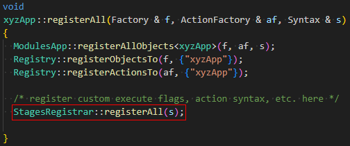

# Stages mooseapp-code-plugin

This MooseApp code plugin contains a set of MooseObjects providing the [Stages] input file blocks.


## Setup for Users

If you want to use this code-plugin in your MooseApp, follow these steps:

- Clone this repository as git-submodule in a sub-folder in `./contrib/` of your MooseApp.
    Assuming you are in the root directory of your MooseApp this could be done with the following command:
  ```shell
  git submodule add https://github.com/jmeier/moose-codeplugin-stages.git contrib/stages
  ```
- In your MooseApp `Makefile`, insert the following line **directly above** the line `include $(FRAMEWORK_DIR)/app.mk` (if you have multiple code plugins, you need this line only once):
  ```MAKEFILE
  include $(wildcard $(CURDIR)/contrib/*/codeplugin.mk)
  ```

- Edit your MooseApp main .C-file (located in `./src/base/`; the file named `xyzApp.C` where `xyz` is the name of your app)
  - at the top where all the includes are, add:
    ```C++
    #include "StagesRegistrar.h"
    ```
  - insert the following line at the end of method `xyzApp::registerAll(Factory & f, ActionFactory & af, Syntax & s)`:
    ```C++
    StagesRegistrar::registerAll(s);
    ```

    The method should now look like this:

    


- Compile your MooseApp.
